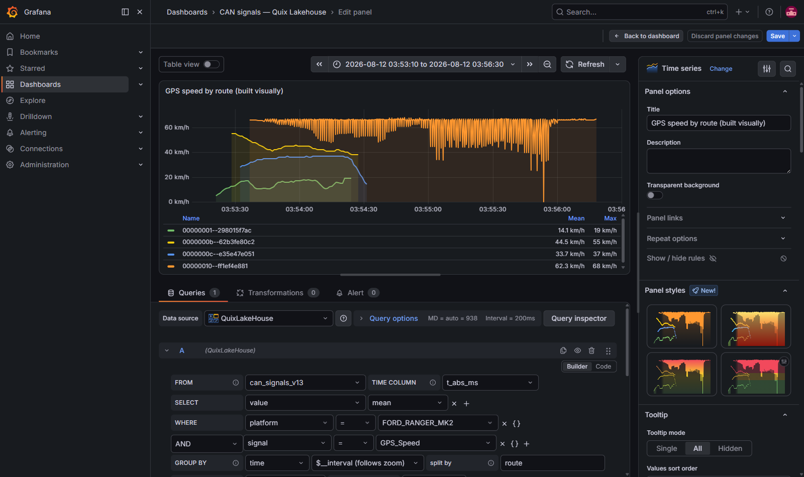
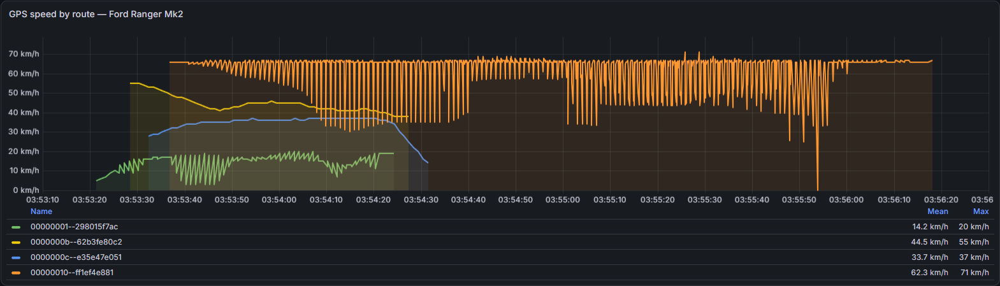

# QuixLakeHouse Grafana data source plugin

[](https://github.com/quixio/quixlakehouse-datasource/actions/workflows/ci.yml)
[](https://github.com/quixio/quixlakehouse-datasource/releases)
[](LICENSE)

A first-party Grafana data source plugin that queries the **Quix Lakehouse** over the
**REST API** (`POST /query`, Arrow IPC). It has a Go backend, so queries run inside
grafana-server: dashboards, Explore, a working server-side "Save & test", and **alert
rules** on lakehouse data.

Build a query without writing SQL — tables, partition columns and their values all come
from the catalog, so the dropdowns fill in under a second where a `SELECT DISTINCT` on
the same column would not return at all:



`split by` turns a tag into one series per value, named after the tag:



- Plugin id: `quix-quixlakehouse-datasource`
- Backend binary: `gpx_quixlakehouse`
- Transport: HTTP `POST {url}/query?format=arrow` (SQL as a `text/plain` body)
- Contributing: [CONTRIBUTING.md](CONTRIBUTING.md) · Changes: [CHANGELOG.md](CHANGELOG.md)
- Known gaps: [ARCHITECTURE.md](ARCHITECTURE.md) §8, and "Known limitations" below.

> An earlier revision of this plugin used Arrow Flight SQL. It was retargeted to REST
> because `quix-ts-datalake-flight` is a translation layer over this same API (an extra
> hop for no added capability), and because the `sqlds` code saving that justified
> Flight turned out not to exist. ARCHITECTURE.md §2 records the full reasoning.
> Flight remains the right path for BI tools (DBeaver, Tableau, ADBC).

Licensed under **Apache-2.0** — see [LICENSE](LICENSE). Dependencies
(`grafana-plugin-sdk-go`, `arrow-go`, `@grafana/create-plugin`) are Apache-2.0 too.
Grafana core is AGPLv3 and no code from it is used here.

---

## Install

Three routes, cheapest first. All of them need the plugin **allowlisted as unsigned** —
it has no Grafana signature yet, so Grafana refuses to load it otherwise:

```
GF_PLUGINS_ALLOW_LOADING_UNSIGNED_PLUGINS=quix-quixlakehouse-datasource
```

### 1. Prebuilt image (easiest)

A stock Grafana with the plugin already baked in, published from this repo:

```
ghcr.io/quixio/quixlakehouse-grafana
```

The image sets `GF_PATHS_PROVISIONING`, the unsigned allowlist and an entrypoint that
writes the datasource provisioning file from two environment variables — so a working
Grafana is one `docker run`:

```bash
docker run -d -p 3000:3000 \
  -e QUIXLAKE_URL='https://<your-lakehouse-query-host>' \
  -e QUIXLAKE_TOKEN='<token or PAT>' \
  -e GF_SECURITY_ADMIN_PASSWORD='<password>' \
  ghcr.io/quixio/quixlakehouse-grafana:dev
```

On Quix Cloud the two lakehouse values are injected by the platform instead — see
[deploy/README.md](deploy/README.md).

#### Using it as a base image

To add your own dashboards, plugins or config, `FROM` it and layer on top:

```dockerfile
FROM ghcr.io/quixio/quixlakehouse-grafana:dev

# Dashboards as code. The entrypoint copies anything under the provisioning template
# directory through untouched, so they survive the datasource rendering step.
COPY dashboards/ /etc/grafana/provisioning-template/dashboards/

# Anything else stock Grafana supports still applies.
ENV GF_USERS_DEFAULT_THEME=light
```

Do **not** override `ENTRYPOINT` — it is what renders the datasource from
`QUIXLAKE_URL` / `QUIXLAKE_TOKEN` before starting Grafana. Overriding it gives you a
Grafana with the plugin installed but no datasource configured.

Pin by digest rather than `:dev` for anything you care about. `:dev` tracks the current
feature branch and moves under you, and an unchanged `FROM` line can be served from a
build cache — so a retag alone does not guarantee you get new code:

```dockerfile
FROM ghcr.io/quixio/quixlakehouse-grafana@sha256:<digest>
```

Read the digest from the `publish-image` workflow run, or with
`docker manifest inspect ghcr.io/quixio/quixlakehouse-grafana:dev`.

### 2. Into an existing Grafana

For a Grafana you already run. **No release zip is published yet** — until one is, build
`dist/` yourself (see [Build](#build)) and copy it in. The directory name must equal the
plugin id or Grafana will not discover it:

```bash
cp -r dist/ /var/lib/grafana/plugins/quix-quixlakehouse-datasource
chmod +x /var/lib/grafana/plugins/quix-quixlakehouse-datasource/gpx_*
# then restart grafana-server
```

Once releases exist, this becomes the usual one-liner on a stock image — no rebuild:

```yaml
environment:
  GF_INSTALL_PLUGINS: "https://github.com/quixio/quixlakehouse-datasource/releases/download/v<x.y.z>/quix-quixlakehouse-datasource-<x.y.z>.zip;quix-quixlakehouse-datasource"
  GF_PLUGINS_ALLOW_LOADING_UNSIGNED_PLUGINS: "quix-quixlakehouse-datasource"
```

That route needs egress to GitHub at boot. Where that is not guaranteed — Quix
environments included — use route 1, which is self-contained.

### 3. Grafana catalog

Not available. Catalog publication requires a Grafana Labs signature, which also makes
this installable on **Grafana Cloud** (unsigned plugins cannot run there at all). Nothing
else changes for self-hosted users, who can already use routes 1 and 2 today.

### Configuring the datasource

However you install it, the datasource needs an **API URL** and an **API token** — see
[Configuration](#configuration). Provisioning them is strongly preferred over the UI:
Grafana's database is not persisted in a container deployment, so a hand-created
datasource disappears on restart while a provisioned one is recreated every boot.

---

## Prerequisites

| Tool | Version used | Notes |
|---|---|---|
| Go | 1.25+ | `go.mod` declares `go 1.25.0` |
| Node | 22+ | `.nvmrc` says 22; 24 also works |
| mage | 1.17+ | `go install github.com/magefile/mage@latest` |
| Docker | any recent | for the dev Grafana |

`@grafana/create-plugin` (only needed to re-scaffold) **does not run on Windows** — use
WSL or a `node:24-bookworm` container.

---

## Build

```bash
# from the repo root

# Frontend -> dist/module.js, dist/plugin.json
npm ci
npm run build

# Backend -> dist/gpx_quixlakehouse_linux_amd64
mage -v build:linux
chmod +x dist/gpx_quixlakehouse_linux_amd64   # required; mage does not set it on Windows
```

`mage -v build:all` cross-compiles every platform. Without mage:

```bash
GOOS=linux GOARCH=amd64 go build -o dist/gpx_quixlakehouse_linux_amd64 ./pkg
```

> Grafana will not launch the plugin if the binary lacks the executable bit. The symptom
> is `Successfully started backend plugin process` never appearing in the Grafana log.

---

## Run

The dev stack is a **stock** Grafana with `dist/` bind-mounted — the same way a user
installs a plugin. It does not run its own lakehouse; it joins the integration stack's
network so it can reach `api:80` directly (the same service is `localhost:8080` from the
host).

```bash
# 1. The lakehouse. This compose file lives in the SEPARATE, private
#    Quix.DataLake.Timeseries repo -- not here. `flight-sql` is NOT needed.
docker compose -f docker-compose.integration-test.yml up -d api

# 2. From THIS repo: Grafana with the plugin.
docker compose -f docker-compose.dev.yml up -d
```

Open <http://localhost:3002> (admin/admin). Port **3002**, because the integration
stack's own Grafana already owns 3001.

The datasource is pre-provisioned as **QuixLakeHouse**, uid `quixlake-rest`
(`provisioning/datasources/quixlakehouse.yml`) pointing at `http://api:80`, so it
exists on boot. Open it and click **Save & test**:

> **Two different uids exist, deliberately.** This dev stack uses `quixlake-rest`, fixed
> so integration tests can address it without a name lookup. The deployable image
> (`deploy/provisioning/datasources/quixlakehouse.yml.tpl`) uses `quixlakehouse`. A
> dashboard JSON hardcoding one will not resolve its datasource on the other — use a
> dashboard variable if a dashboard has to work on both.

```
Connected to the QuixLake API at http://api:80.
```

Teardown (only ever touches this file's container):

```bash
docker compose -f docker-compose.dev.yml down
```

---

## Try a query

New dashboard → new panel → datasource **QuixLakeHouse**:

```sql
SELECT timestamp, speed_kmh
FROM test_telemetry
WHERE $__timeFilter(timestamp)
  AND year = 2026 AND circuit = 'monaco' AND session_type = 'practice'
ORDER BY timestamp
```

Leave **Format** = `Time series` and **Time format** = `Epoch milliseconds`.

> **Always include partition filters** (`year`, `circuit`, `session_type`). Unpruned
> full-table scans currently fail intermittently against the local stack — an API-side
> Arrow-path bug, not a plugin bug. ARCHITECTURE.md §7 item 1.

### Macros

Expanded in the **backend**, so they work in alert rules too (an alert rule has no
browser, so frontend-interpolated variables do not exist there).

| Macro | `epoch_ms` column | native `TIMESTAMP` column |
|---|---|---|
| `$__timeFilter(col)` | `col >= 1785835272409 AND col <= 1785838872409` | `col >= '2026-08-04T09:21:58Z' AND col <= '...'` |
| `$__timeFrom()` / `$__timeTo()` | `1785835272409` | `'2026-08-04T09:21:58Z'` |
| `$__timeGroup(col, 1m)` | `time_bucket(INTERVAL '1 minutes', epoch_ms(col))` | `time_bucket(INTERVAL '1 minutes', CAST(col AS TIMESTAMP))` |
| `$__timeGroup(col, $__interval)` | interval taken from the panel | same |

Interval units: `ms`, `s`, `m`, `h`, `d`, `w`, `M`, `y`.

`$__from`, `$__to` and `$__interval` on their own are **Grafana global variables**, not
plugin macros — the frontend replaces them with bare epoch milliseconds before the
backend sees them. Use `$__timeFrom()` / `$__timeTo()` instead so dashboards and alerts
agree. (`$__interval` *is* honoured inside `$__timeGroup`.)

### Why "Time format" matters

QuixLake time-series tables store time as an **INT64 epoch**, not a native `TIMESTAMP` —
`test_telemetry.timestamp` is epoch milliseconds. The backend needs to know that both to
compare `$__timeFilter` against an integer instead of a string, and to turn the column
into a real Grafana time field. Getting it wrong is the difference between a rendered
chart and an empty panel (or timestamps in 1970).

---

## Iterating

**Backend:**

```bash
mage -v build:linux && chmod +x dist/gpx_quixlakehouse_linux_amd64
docker compose -f docker-compose.dev.yml restart grafana
```

Grafana caches the plugin process, so a restart is required. Backend logs:

```bash
docker logs -f quixlakehouse-plugin-dev-grafana 2>&1 | grep quixlakehouse
```

`GF_LOG_FILTERS` already sets this plugin to `debug`, so every executed SQL statement is
logged.

**Frontend:**

```bash
npm run dev        # webpack watch; rewrites dist/module.js
```

Then hard-reload the browser — no Grafana restart needed for frontend-only changes.

---

## Configuration

| Field | Storage | Default | Notes |
|---|---|---|---|
| API URL | Grafana's standard `url` field | — | e.g. `http://api:80`. The **API root** — no `/grafana` suffix. Using the standard field gives the backend TLS + proxy options for free. |
| API token | `secureJsonData.token` | — | sent as `Authorization: Bearer <token>`; accepts the static API token or a Quix platform token / PAT. Encrypted at rest; never returned to the browser. |
| Union by name | `jsonData.unionByName` | `true` | maps to `?union_by_name=true`, so schema drift across files does not break `SELECT *` |
| Query timeout (s) | `jsonData.timeoutSeconds` | `60` | per-query budget |

All are settable from provisioning YAML.

---

## Layout

```
pkg/
  main.go                 datasource.Manage(plugin.PluginID, ...)
  models/settings.go      jsonData + secureJsonData
  plugin/
    ids.go                plugin id / binary name constants
    datasource.go         QueryData + CheckHealth, query model
    rest.go               POST /query, error detection, content-type dispatch
    frames.go             Arrow record batches -> data.Frame
    csvframe.go           CSV -> data.Frame (the API does not always honour ?format=arrow)
    macros.go             $__timeFilter / $__timeFrom / $__timeTo / $__timeGroup
    timefmt.go            epoch-vs-timestamp model
src/
  plugin.json             backend: true, alerting: true, category: sql
  module.ts, datasource.ts, types.ts
  components/ConfigEditor.tsx, QueryEditor.tsx
provisioning/datasources/quixlakehouse.yml   dev stack, uid quixlake-rest
deploy/                   deployable image: Dockerfile, entrypoint, provisioning template
.github/workflows/        ci.yml (lint/test/build)
                          plugin-validator.yml (Grafana's plugin validator, weekly too)
                          release.yml (installable zip on a v* tag)
                          publish-image.yml (GHCR)
docker-compose.dev.yml
.env                      PLUGIN_ID / GRAFANA_PORT / GRAFANA_VERSION
                          NOT tracked -- gitignored, it holds live tokens
```

UI is functional and unstyled by design — visual polish is a separate pass.

---

## Known limitations

Full list in [ARCHITECTURE.md](ARCHITECTURE.md) §7. The ones you will hit first:

1. **Queries touching many files fail** against a churned local stack — the sink writes
   ~6 tiny files every few seconds, so a wide scan must HEAD thousands of objects and
   MinIO starts refusing connections. Use partition filters; if even those fail, the
   stack needs compaction. Not a plugin bug.
2. **Raw SQL only** — no visual builder, no dashboard variables, no ad-hoc filters, no
   annotations.
3. **`maxDataPoints` is not pushed down** — a panel returns whatever the SQL returns.
4. **An empty result costs one extra query.** Arrow has no error channel, so an empty
   Arrow body is ambiguous (failed vs genuinely empty) and the plugin re-asks over CSV
   once to disambiguate. Never on the happy path. ARCHITECTURE.md §5.
5. **Queries are attributed to `source="api"`**, not to Grafana.
6. **Unsigned** — needs `GF_PLUGINS_ALLOW_LOADING_UNSIGNED_PLUGINS` and Grafana shows a
   warning banner.
7. **`linux/amd64` only.** CI (`.github/workflows/ci.yml`) runs lint, vet, typecheck and
   build, but **there are no unit tests yet** — `go test ./...` finds no test files and
   `test:ci` runs jest with `--passWithNoTests`, so both pass vacuously.
8. **The whole result is buffered in memory** before the frame is built — no result-size
   ceiling yet. ARCHITECTURE.md §8.
